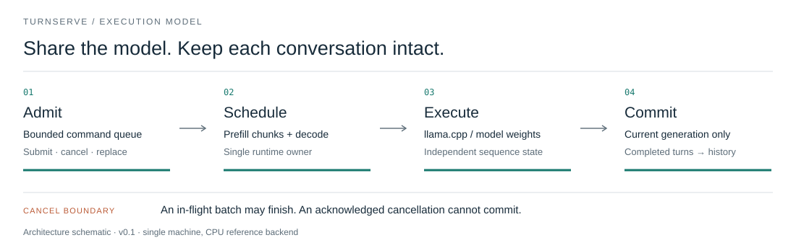
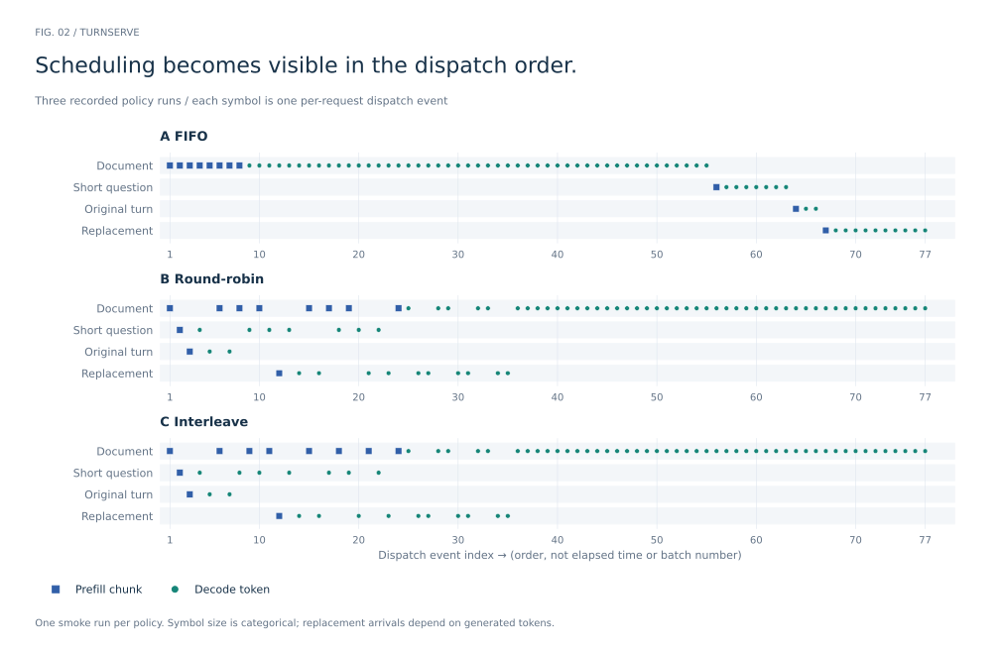
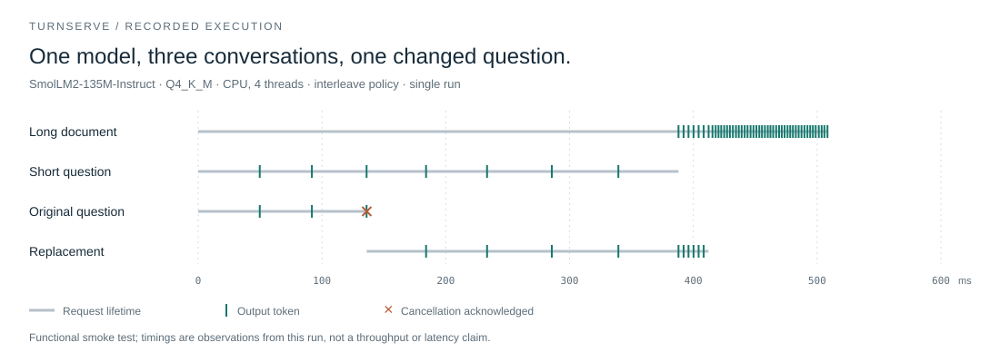
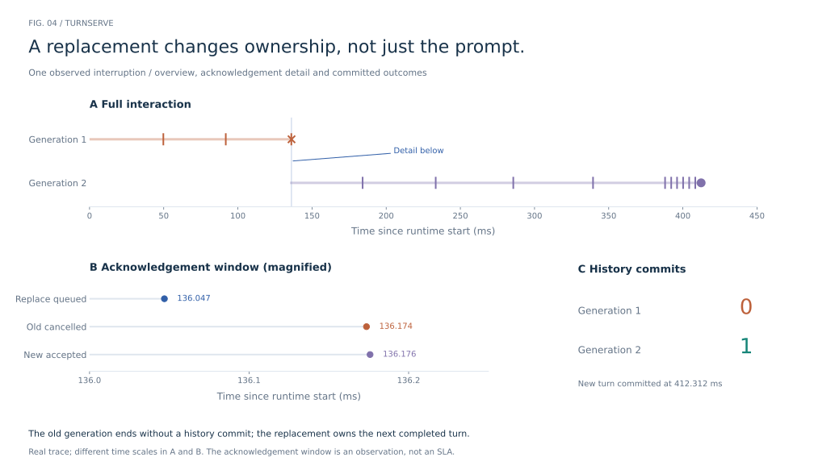

# TurnServe

C++ LLM inference runtime with multi-session scheduling, cancellation-safe turn replacement, and trace-driven observability.

[Build & tests](https://github.com/Mingkai406/turnserve/actions/workflows/ci.yml) · [Design](docs/design.md) · [Recorded run](results/smoke-cpu/README.md) · [Roadmap](docs/roadmap.md)

A long prompt, a short question, and an interrupted answer compete for the same model. TurnServe makes that competition explicit: it schedules prefill and decode work, bounds admission, and keeps cancelled generations out of committed conversation history.



## What works today

The first version includes a C++20 runtime, three scheduling policies, explicit request replacement, bounded queues and session state, and a real **llama.cpp CPU backend** pinned to a commit. Model weights and inference kernels come from llama.cpp; TurnServe implements the request lifecycle and scheduling loop.

## See the runtime at work

The figures below use checked-in **SmolLM2-135M-Instruct Q4_K_M** inference traces. Three conversations share one model; one question is replaced after its third output token. Each figure answers a different question.

### How is work scheduled?

Prefill chunks are squares; decode steps are circles. The facets expose dispatch order under each policy. A position on this axis is an event index, not a time measurement or a batch number.



### When does each conversation produce output?

The step curves show emitted token counts. The companion plot separates time to first token from time to completion or cancellation, measured from each request's submission.



### What happens when the user changes the question?

The full interaction and magnified acknowledgement window expose the handoff between generations. The original turn has no history commit; the replacement has one.



[Raw traces and run conditions](results/smoke-cpu/README.md) · [Figure sources, visual references and reproduction](docs/figures.md)

These are functional smoke runs, not a controlled performance comparison. Replacement arrival times depend on generated tokens. The current implementation is a local runtime and replay tool; the streaming HTTP adapter is the next integration layer.

## Fixed-arrival load experiment

The separate `turnserve-load` executable replays a workload from an independent producer.
[Recorded CPU comparison](results/fixed-arrival/README.md) includes three repetitions of all
three policies, arrival-to-first-token/completion timings, dispatch lag and failure-aware
deadline success. FIFO wins this small workload; the evidence does not support a universal
interleaving speedup.

## Run it

Requires a C++20 compiler, CMake 3.24+, and Git. Python 3.10+ is used only for model download and trace inspection. Linux and macOS are the initial targets.

### 1. Build the core

```sh
git clone https://github.com/Mingkai406/turnserve.git
cd turnserve
cmake -S . -B build -DCMAKE_BUILD_TYPE=Debug -DTURNSERVE_SANITIZE=ON
cmake --build build --parallel 2
ctest --test-dir build --output-on-failure
./build/turnserve-replay --trace synthetic.jsonl
python3 scripts/inspect_trace.py synthetic.jsonl
```

This path uses a deterministic synthetic backend for lifecycle tests. It does not run a language model and its timings are not meaningful inference measurements.

### 2. Run real inference

```sh
python3 scripts/fetch_model.py
cmake -S . -B build-llama -DCMAKE_BUILD_TYPE=Release \
  -DTURNSERVE_LLAMA=ON -DGGML_NATIVE=OFF
cmake --build build-llama --parallel 2
mkdir -p runs
./build-llama/turnserve-replay \
  --model models/SmolLM2-135M-Instruct-Q4_K_M.gguf \
  --policy interleave --threads 4 --trace runs/interleave.jsonl
python3 scripts/inspect_trace.py runs/interleave.jsonl
```

The downloader verifies the pinned model's SHA-256; weights are about 101 MiB and stay outside Git. This small model is useful for exercising the runtime, not for demonstrating application quality. The reference build uses CPU inference, including the platform's available math libraries.

Use `--policy fifo`, `--policy round-robin`, or `--policy interleave` to run the same scripted scenario under another policy. Replacement is triggered by the third output token, so arrival times differ across policies. Do not interpret this demo as a controlled benchmark.

## Two decisions that shape the implementation

**One owner for model state.** Producers can submit commands concurrently. One runtime owner handles admission, scheduling, backend execution, and history commits. This keeps model state transitions serial while the backend can use CPU worker threads internally. The public `tick()` API makes batch boundaries observable and testable.

**Cancellation has an acknowledgement boundary.** Enqueuing cancellation does not preempt an in-flight model computation. Once the owner acknowledges it, the cancelled request emits no more tokens and cannot commit a turn. Replacement is validated before the old request is cancelled. A malformed replacement therefore does not destroy useful work.

| Policy | Behavior | Tradeoff to examine |
|---|---|---|
| `fifo` | Run the oldest admitted request to completion | Simple; short turns can wait behind long work |
| `round-robin` | Rotate active requests; limit each prefill chunk | Shares progress; mixed batches still have variable cost |
| `interleave` | Schedule one decode token per decoding request first, then rotated prefill chunks | Leaves prefill budget because the batch budget exceeds the slot count; token budgets are not time guarantees |

All policies use the same context limits and backend. This version does not implement prefix sharing or cross-request speculative decoding. It rebuilds a session's prompt from committed history on the next turn, which makes recovery straightforward at the cost of repeated prefill.

## Read the code

| File | Responsibility |
|---|---|
| [`src/runtime.cpp`](src/runtime.cpp) | Admission, scheduling, lifecycle, cancellation and history |
| [`src/llama_backend.cpp`](src/llama_backend.cpp) | Chat formatting, tokenization, sequence batches, greedy sampling and cleanup |
| [`tests/runtime_test.cpp`](tests/runtime_test.cpp) | Eight contract suites, including concurrent producers and cancellation during a blocked decode |
| [`apps/replay.cpp`](apps/replay.cpp) | The reproducible three-conversation demonstration |
| [`scripts/inspect_trace.py`](scripts/inspect_trace.py) | Trace invariants, per-request outcomes and timings |

The [design notes](docs/design.md) describe API ownership, limits, failure behavior, and trace encoding. The [experiment plan](docs/experiments.md) separates the current smoke test from the controlled measurements still needed.

## Where this is going

Fixed-arrival ingestion and repeated local policy measurements are implemented. The next step is a broader load matrix and an upstream llama-server reference. After that, a streaming adapter can expose the runtime to interactive applications. Compatible fine-tuned models can replace the current test weights; model training and application-specific evaluation remain separate concerns.

## Prior work and dependencies

TurnServe builds on [llama.cpp](https://github.com/ggml-org/llama.cpp), whose native server already supports continuous batching and prompt caching. Chunked prefill and latency/throughput scheduling have substantial prior work, including [Sarathi-Serve](https://arxiv.org/abs/2403.02310). [Locality-aware Fair Scheduling](https://arxiv.org/abs/2501.14312) studies the fairness/locality tradeoff.

This repository explores their surrounding engineering questions in an inspectable C++ runtime. It does not claim a new scheduling algorithm or a speedup over those systems.

MIT licensed. Third-party code and model weights retain their own licenses; see [NOTICE](NOTICE).
